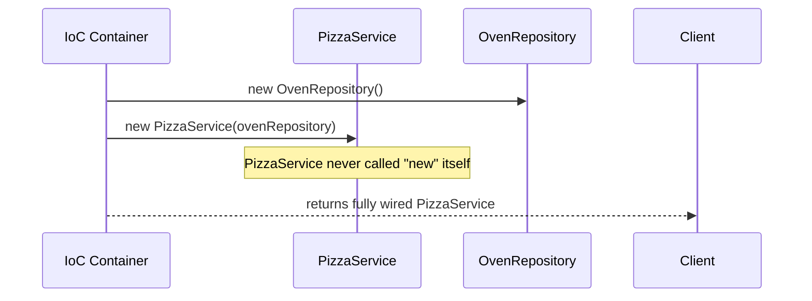

# Dependency Injection (DI)

## 1. What & Why

A class often needs help from another class to do its job — a `PizzaService` needs an `OvenRepository` to actually cook. The naive way is for `PizzaService` to build its own `OvenRepository` with `new OvenRepository()`. That's a problem: `PizzaService` is now *tightly coupled* to one specific `OvenRepository` implementation, and testing it means you're stuck testing the real oven too.

**Dependency Injection** flips this: instead of a class creating what it depends on, something external *hands it* the dependency, already built. That "something external" is the Spring IoC container (covered in file 02).

> Analogy: you don't build your own laptop from parts on your first day at a job — IT hands you one, already configured. You just use it. That's injection.

Spring supports three ways to inject a dependency:

| Type | How | Recommended? |
|---|---|---|
| Constructor Injection | Dependency passed via constructor | ✅ Preferred |
| Setter Injection | Dependency passed via a setter method | ⚠️ Situational (optional/circular deps) |
| Field Injection | `@Autowired` directly on the field | ❌ Avoid in real code |

**Why constructor injection is preferred:**
- Dependencies are `final` → the object is immutable once built, can't be silently changed later.
- The object literally *cannot* exist in a half-wired state — if a required dependency is missing, the app fails fast at startup, not at 2am in production.
- Makes unit testing trivial: just call `new PizzaService(mockOvenRepository)` — no Spring container needed at all.
- Field injection hides dependencies (you have to open the class to know what it needs) and makes the class impossible to instantiate without reflection/Spring, which breaks plain unit tests.

## 2. Code Demo

**Constructor Injection (preferred):**

```java
@Repository
public class OvenRepository {
    public String cook(String item) {
        return "Cooked: " + item;
    }
}

@Service
public class PizzaService {

    private final OvenRepository ovenRepository;

    // Spring sees this constructor and injects OvenRepository automatically.
    // @Autowired is optional here (Spring 4.3+) when there's only one constructor.
    public PizzaService(OvenRepository ovenRepository) {
        this.ovenRepository = ovenRepository;
    }

    public String makePizza() {
        return ovenRepository.cook("Pizza");
    }
}
```

**Setter Injection:**

```java
@Service
public class PizzaService {

    private OvenRepository ovenRepository;

    @Autowired
    public void setOvenRepository(OvenRepository ovenRepository) {
        this.ovenRepository = ovenRepository;
    }
}
```

**Field Injection (shown to recognize it, not to use it):**

```java
@Service
public class PizzaService {

    @Autowired
    private OvenRepository ovenRepository; // works, but can't be final, hard to unit test
}
```

**Testing why constructor injection wins — no Spring context needed at all:**

```java
class PizzaServiceTest {
    @Test
    void makesPizza() {
        OvenRepository fakeOven = new OvenRepository();
        PizzaService service = new PizzaService(fakeOven); // plain Java, no @SpringBootTest
        assertEquals("Cooked: Pizza", service.makePizza());
    }
}
```

## 3. Diagram



## 4. Interview Notes

- **"Why constructor over field injection?"** → Immutability, fail-fast at startup, testability without a container, no reflection hacks needed.
- **"What happens if you have two constructors?"** → Spring needs to know which one to use; mark the intended one with `@Autowired`, or Spring will error out with ambiguity (unless there's exactly one, then it's implicit).
- **"Is `@Autowired` mandatory?"** → No, only required when there's more than one constructor, or for setter/field injection.
- **"When would you actually use setter injection?"** → Optional dependencies, or as one of the two standard ways to break a circular dependency (see file 05).
