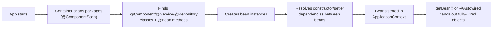

# Inversion of Control (IoC) & the Spring Container

## 1. What & Why

**Inversion of Control** is the principle; **Dependency Injection** (file 01) is one way to implement it. IoC means: control over *object creation and wiring* is taken away from your code and handed to a framework.

Normally, your code controls the flow: you call `new`, you decide what gets created and when. With IoC, that control is *inverted* — a container decides what to create, when, and how to wire it together. You just describe *what* you need (via annotations), not *how* to build it.

> Analogy: Without IoC, you're the chef who also has to grow the vegetables, forge the knives, and build the stove. With IoC, you just say "I need a chopped onion" and the kitchen (container) hands it to you, already prepped.

The **Spring IoC Container** is the engine that does this. It's represented by the `ApplicationContext` interface. Its job, in order:

1. Scan for classes marked as components (`@Component`, `@Service`, etc.) or defined via `@Bean` methods.
2. Create instances of them (these instances are called **beans**).
3. Resolve dependencies between beans and inject them.
4. Manage their full lifecycle (file 06) until the app shuts down.

## 2. Code Demo

```java
@Configuration
@ComponentScan(basePackages = "com.example.demo")
public class AppConfig { }

@Component
public class Engine {
    public String start() { return "Engine started"; }
}

@Component
public class Car {
    private final Engine engine;

    public Car(Engine engine) { this.engine = engine; }

    public String drive() { return engine.start() + " -> Car driving"; }
}

public class MainApp {
    public static void main(String[] args) {
        // This one line does steps 1-3 above: scan, create, wire.
        ApplicationContext context =
            new AnnotationConfigApplicationContext(AppConfig.class);

        Car car = context.getBean(Car.class);
        System.out.println(car.drive()); // "Engine started -> Car driving"

        // Notice: nowhere did we write `new Car(new Engine())`.
        // The container built the whole graph for us.
    }
}
```

In a Spring Boot app you rarely touch `ApplicationContext` directly — `@SpringBootApplication` bootstraps it for you, and `@ComponentScan` is implied for the package your main class lives in.

```java
@SpringBootApplication
public class DemoApplication {
    public static void main(String[] args) {
        SpringApplication.run(DemoApplication.class, args);
        // Under the hood, this still creates and returns an ApplicationContext.
    }
}
```

## 3. Diagram



## 4. Interview Notes

- **"What is IoC vs DI?"** → IoC is the principle (control is inverted, handed to a framework); DI is the specific technique Spring uses to implement IoC (injecting dependencies rather than the object creating them itself).
- **"What is `ApplicationContext`?"** → The interface representing the Spring IoC container — it's what actually holds, creates, and wires beans.
- **"`BeanFactory` vs `ApplicationContext`?"** → `BeanFactory` is the basic container (lazy init, minimal features); `ApplicationContext` extends it with eager init by default, event handling, internationalization, and is what's used in virtually all real Spring apps.
- **"Does Spring Boot remove the container?"** → No — `@SpringBootApplication` just auto-configures and bootstraps an `ApplicationContext` for you so you don't wire it manually.
