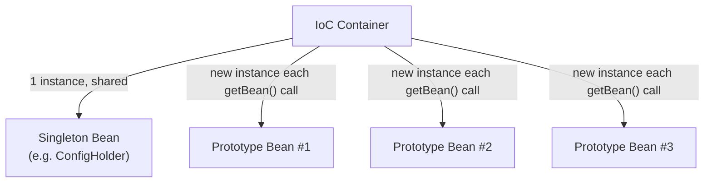

# Bean Scopes

## 1. What & Why

**Scope** answers: "when I ask the container for this bean, do I get the *same* instance every time, or a *new* one?"

| Scope | Instances | Typical use |
|---|---|---|
| `singleton` (default) | One per container, shared everywhere | Stateless services, repositories — most beans |
| `prototype` | New instance every time it's requested | Stateful, non-thread-safe objects (e.g. a per-use builder) |
| `request` | One per HTTP request (web apps only) | Data tied to a single web request |
| `session` | One per HTTP session (web apps only) | Per-user data across multiple requests |
| `application` | One per `ServletContext` (web apps only) | Shared app-wide web data |

> Analogy: `singleton` is the office printer — everyone shares the one instance. `prototype` is a disposable coffee cup — a fresh one is handed out every single time someone asks.

**Important gotcha:** `singleton` in Spring means "one per container," *not* "one per JVM" like the Gang-of-Four Singleton pattern. If you spin up two `ApplicationContext`s, you get two singleton instances — one each.

## 2. Code Demo

```java
@Component
@Scope("singleton") // this is also the default, doesn't need to be written
public class ConfigHolder {
    private int value = 0;
    public void increment() { value++; }
    public int getValue() { return value; }
}

@Component
@Scope("prototype")
public class RequestId {
    private final String id = UUID.randomUUID().toString();
    public String getId() { return id; }
}
```

```java
@RestController
public class ScopeDemoController {
    private final ConfigHolder configHolder;
    private final ObjectProvider<RequestId> requestIdProvider;
    // ObjectProvider is used instead of a direct field so a *new* prototype
    // bean is fetched on each call, not just once at controller construction time.

    public ScopeDemoController(ConfigHolder configHolder,
                                ObjectProvider<RequestId> requestIdProvider) {
        this.configHolder = configHolder;
        this.requestIdProvider = requestIdProvider;
    }

    @GetMapping("/demo")
    public String demo() {
        configHolder.increment();
        String idA = requestIdProvider.getObject().getId();
        String idB = requestIdProvider.getObject().getId();

        return "Singleton count: " + configHolder.getValue()
             + " | Prototype A: " + idA
             + " | Prototype B: " + idB;
    }
}
```

Hit `/demo` three times and observe:
- `Singleton count` keeps incrementing (1, 2, 3...) — same `ConfigHolder` instance reused.
- `Prototype A` and `Prototype B` are *different* UUIDs on every single call, even within the same request — a fresh `RequestId` bean is created each time `getObject()` runs.

**Why `ObjectProvider` and not direct injection?** If you just did `private final RequestId requestId;` via constructor injection, Spring would inject *one* prototype instance at controller-creation time (since the controller itself is a singleton, created once) — and you'd be stuck reusing that one instance forever. `ObjectProvider<RequestId>` defers the `getBean()` call until you actually invoke `.getObject()`, so you genuinely get a new one each time.

## 3. Diagram


