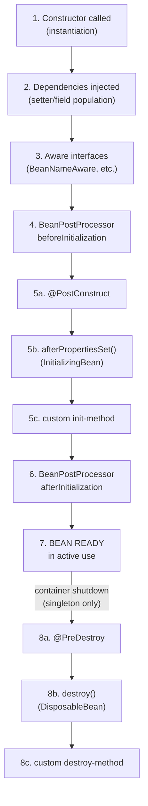

# Bean Lifecycle

## 1. What & Why

Every bean goes through the same journey inside the container, from "doesn't exist yet" to "destroyed on shutdown." Knowing this order matters because it tells you *exactly which hook to use* when you need to run code right after a bean is fully wired (e.g. open a DB connection pool) or right before the app shuts down (e.g. close it).

> Analogy: it's like an employee's journey at a company — hired (instantiated), given their equipment (dependencies injected), given their employee ID (`BeanNameAware`), sent to orientation (`@PostConstruct`), then put to work — and finally, an exit interview and badge return before they leave (`@PreDestroy`).

**The full order, in one pass:**

1. **Instantiation** — container calls the constructor. Object exists, but its fields aren't set yet.
2. **Populate properties** — dependencies are injected (constructor args already went in at step 1; setter/field injections happen now).
3. **Aware interfaces called** (if implemented) — e.g. `BeanNameAware.setBeanName()`, `BeanFactoryAware.setBeanFactory()` — the bean is told about its own name/container.
4. **`BeanPostProcessor.postProcessBeforeInitialization()`** — runs for *every* bean in the container, before init callbacks. (Framework-level hook, rarely written by app developers, but explains how things like `@Autowired` processing and AOP proxies get applied.)
5. **Initialization callbacks, in this order:**
   - `@PostConstruct`-annotated method (most common in app code)
   - `afterPropertiesSet()` if the bean implements `InitializingBean`
   - a custom `init-method` if one was specified (e.g. via `@Bean(initMethod = "...")`)
6. **`BeanPostProcessor.postProcessAfterInitialization()`** — runs after init callbacks.
7. **Bean is ready** — sits in the container, fully usable, until shutdown.
8. **Destruction callbacks, in this order** (only for singleton-scoped beans, on container shutdown):
   - `@PreDestroy`-annotated method (most common in app code)
   - `destroy()` if the bean implements `DisposableBean`
   - a custom `destroy-method` if specified

**Key gotcha:** destruction callbacks only fire for **singleton** beans (file 04). Prototype beans are handed off by the container after creation — Spring doesn't track them for shutdown, so `@PreDestroy` never fires on a prototype bean. You're responsible for cleaning those up yourself if needed.

## 2. Code Demo

This demo prints at every stage so you can literally watch the order happen at app startup and shutdown.

```java
@Component
public class DatabaseConnection implements
        BeanNameAware, InitializingBean, DisposableBean {

    public DatabaseConnection() {
        System.out.println("1. Constructor called — instance exists, no deps yet");
    }

    @Autowired
    public void setUrl(@Value("${db.url:jdbc:demo}") String url) {
        System.out.println("2. Setter injection — properties populated (" + url + ")");
    }

    @Override
    public void setBeanName(String name) {
        System.out.println("3. BeanNameAware — this bean is named: " + name);
    }

    @PostConstruct
    public void postConstruct() {
        System.out.println("4. @PostConstruct — connection pool warming up");
    }

    @Override
    public void afterPropertiesSet() {
        System.out.println("5. afterPropertiesSet (InitializingBean) — final checks before ready");
    }

    public void customInit() {
        System.out.println("6. custom init-method — ready to accept queries");
    }

    public void useConnection() {
        System.out.println("--- bean is in active use ---");
    }

    @PreDestroy
    public void preDestroy() {
        System.out.println("7. @PreDestroy — draining active queries");
    }

    @Override
    public void destroy() {
        System.out.println("8. destroy (DisposableBean) — closing connection pool");
    }

    public void customDestroy() {
        System.out.println("9. custom destroy-method — connection fully released");
    }
}
```

Registering the custom init/destroy methods (since those two aren't interfaces, they need to be named explicitly):

```java
@Configuration
public class AppConfig {

    @Bean(initMethod = "customInit", destroyMethod = "customDestroy")
    public DatabaseConnection databaseConnection() {
        return new DatabaseConnection();
    }
}
```

**Running it** (`context.close()` triggers destruction):

```java
public class MainApp {
    public static void main(String[] args) {
        ConfigurableApplicationContext context =
            new AnnotationConfigApplicationContext(AppConfig.class);

        DatabaseConnection conn = context.getBean(DatabaseConnection.class);
        conn.useConnection();

        context.close(); // triggers steps 7, 8, 9 in order
    }
}
```

**Expected console output, top to bottom:**
```
1. Constructor called — instance exists, no deps yet
2. Setter injection — properties populated (jdbc:demo)
3. BeanNameAware — this bean is named: databaseConnection
4. @PostConstruct — connection pool warming up
5. afterPropertiesSet (InitializingBean) — final checks before ready
6. custom init-method — ready to accept queries
--- bean is in active use ---
7. @PreDestroy — draining active queries
8. destroy (DisposableBean) — closing connection pool
9. custom destroy-method — connection fully released
```

## 3. Diagram



## 4. Interview Notes

- **"`@PostConstruct` vs `InitializingBean.afterPropertiesSet()` — which to use?"** → `@PostConstruct` (standard `jakarta.annotation`, no Spring-specific interface, keeps the class framework-agnostic). `InitializingBean` ties your class directly to Spring's API — avoid unless you have a specific reason (e.g. writing a reusable library bean whose init order must be guaranteed at the interface level, since interface callbacks run at a fixed point relative to annotation-based ones).
- **"Does `@PreDestroy` fire for prototype beans?"** → No — the container hands off prototype beans after construction and does not track them for destruction. This is a common trick interview question.
- **"What's the point of `BeanPostProcessor`?"** → It's how Spring itself implements many of its own features — e.g. AOP proxy creation and processing `@Autowired`/`@Value` happen via built-in `BeanPostProcessor`s. You'd write a custom one only for cross-cutting framework-level behavior across *all* beans, not typical app logic.
- **"What triggers destruction callbacks?"** → `ConfigurableApplicationContext.close()`, or the JVM shutdown hook Spring Boot registers automatically — which is why `@PreDestroy` logs still show up on a Spring Boot app killed with Ctrl+C.
