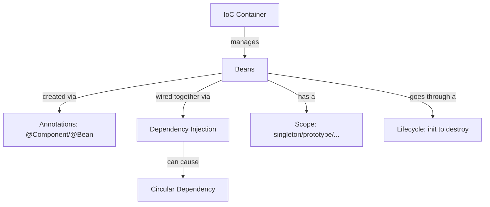

# Java Spring Boot — Learning Log

A day-by-day, concept-by-concept log of my Spring / Spring Boot learning, documented the same way as my [Data-Structures-and-Algorithms---leetcode](.) repo: one file per topic, plain-English explanation first, working code demo second, diagram where it helps, and a short interview-notes section at the end.

## Why this repo exists

Tutorials fade from memory fast. Writing the concept in my own words + a runnable code snippet + the "gotcha" that trips people up in interviews is what actually sticks. This repo is that notebook, kept public so it doubles as proof of learning for recruiters/HR skimming my GitHub.

## How each topic file is structured

Every file in this repo follows the same four sections:

1. **What & Why** — plain-English explanation, with an analogy if the concept is abstract (e.g. IoC container ≈ a hiring manager who assigns you your tools instead of you buying your own).
2. **Code Demo** — a minimal, self-contained Spring code example that actually demonstrates the behavior (not just a definition).
3. **Diagram** — a flow/sequence diagram where the concept is about *order of operations* or *object relationships* (bean lifecycle, container flow, circular dependency).
4. **Interview Notes** — the 3-4 things that are actually asked about this topic, phrased the way an interviewer would probe them.

## Contents

| # | Topic | File | Status |
|---|-------|------|--------|
| 01 | Dependency Injection (constructor / setter / field) | [`01-dependency-injection.md`](./01-dependency-injection.md) | ✅ Done |
| 02 | IoC & the Spring Container | [`02-ioc-container.md`](./02-ioc-container.md) | ✅ Done |
| 03 | Bean Annotations (`@Component`, `@Bean`, stereotypes) | [`03-bean-annotations.md`](./03-bean-annotations.md) | ✅ Done |
| 04 | Bean Scopes (singleton / prototype / web scopes) | [`04-bean-scopes.md`](./04-bean-scopes.md) | ✅ Done |
| 05 | Circular Dependency | [`05-circular-dependency.md`](./05-circular-dependency.md) | ✅ Done |
| 06 | Bean Lifecycle | [`06-bean-lifecycle.md`](./06-bean-lifecycle.md) | 🔄 In Progress |

More files will be added as I move into AOP, Spring MVC, Spring Data JPA, and Spring Security.

## Big picture — how these topics connect

The IoC container is the foundation everything else sits on: it *creates* beans (using annotations to know what to create), *injects* dependencies between them, gives each one a *scope*, and walks each one through a *lifecycle* from creation to destruction. Circular dependency is really a DI problem that surfaces because of how the container resolves construction order.

## Tech context

- Spring Boot (embedded Tomcat, auto-configuration)
- Java 17+
- Maven
- Examples are trimmed to the relevant class(es) only — assume a standard `@SpringBootApplication` entry point unless a file says otherwise.# Java Spring Boot — Learning Log

A day-by-day, concept-by-concept log of my Spring / Spring Boot learning, documented the same way as my [Data-Structures-and-Algorithms---leetcode](.) repo: one file per topic, plain-English explanation first, working code demo second, diagram where it helps, and a short interview-notes section at the end.

## Why this repo exists

Tutorials fade from memory fast. Writing the concept in my own words + a runnable code snippet + the "gotcha" that trips people up in interviews is what actually sticks. This repo is that notebook, kept public so it doubles as proof of learning for recruiters/HR skimming my GitHub.

## How each topic file is structured

Every file in this repo follows the same four sections:

1. **What & Why** — plain-English explanation, with an analogy if the concept is abstract (e.g. IoC container ≈ a hiring manager who assigns you your tools instead of you buying your own).
2. **Code Demo** — a minimal, self-contained Spring code example that actually demonstrates the behavior (not just a definition).
3. **Diagram** — a flow/sequence diagram where the concept is about *order of operations* or *object relationships* (bean lifecycle, container flow, circular dependency).
4. **Interview Notes** — the 3-4 things that are actually asked about this topic, phrased the way an interviewer would probe them.

## Contents

| # | Topic | File | Status |
|---|-------|------|--------|
| 01 | Dependency Injection (constructor / setter / field) | [`01-dependency-injection.md`](./01-dependency-injection.md) | ✅ Done |
| 02 | IoC & the Spring Container | [`02-ioc-container.md`](./02-ioc-container.md) | ✅ Done |
| 03 | Bean Annotations (`@Component`, `@Bean`, stereotypes) | [`03-bean-annotations.md`](./03-bean-annotations.md) | ✅ Done |
| 04 | Bean Scopes (singleton / prototype / web scopes) | [`04-bean-scopes.md`](./04-bean-scopes.md) | ✅ Done |
| 05 | Circular Dependency | [`05-circular-dependency.md`](./05-circular-dependency.md) | ✅ Done |
| 06 | Bean Lifecycle | [`06-bean-lifecycle.md`](./06-bean-lifecycle.md) | 🔄 In Progress |

More files will be added as I move into AOP, Spring MVC, Spring Data JPA, and Spring Security.

## Big picture — how these topics connect

The IoC container is the foundation everything else sits on: it *creates* beans (using annotations to know what to create), *injects* dependencies between them, gives each one a *scope*, and walks each one through a *lifecycle* from creation to destruction. Circular dependency is really a DI problem that surfaces because of how the container resolves construction order.

## Tech context

- Spring Boot (embedded Tomcat, auto-configuration)
- Java 17+
- Maven
- Examples are trimmed to the relevant class(es) only — assume a standard `@SpringBootApplication` entry point unless a file says otherwise.# Java Spring Boot — Learning Log

A day-by-day, concept-by-concept log of my Spring / Spring Boot learning, documented the same way as my [Data-Structures-and-Algorithms---leetcode](.) repo: one file per topic, plain-English explanation first, working code demo second, diagram where it helps, and a short interview-notes section at the end.

## Why this repo exists

Tutorials fade from memory fast. Writing the concept in my own words + a runnable code snippet + the "gotcha" that trips people up in interviews is what actually sticks. This repo is that notebook, kept public so it doubles as proof of learning for recruiters/HR skimming my GitHub.

## How each topic file is structured

Every file in this repo follows the same four sections:

1. **What & Why** — plain-English explanation, with an analogy if the concept is abstract (e.g. IoC container ≈ a hiring manager who assigns you your tools instead of you buying your own).
2. **Code Demo** — a minimal, self-contained Spring code example that actually demonstrates the behavior (not just a definition).
3. **Diagram** — a flow/sequence diagram where the concept is about *order of operations* or *object relationships* (bean lifecycle, container flow, circular dependency).
4. **Interview Notes** — the 3-4 things that are actually asked about this topic, phrased the way an interviewer would probe them.

## Contents

| # | Topic | File | Status |
|---|-------|------|--------|
| 01 | Dependency Injection (constructor / setter / field) | [`01-dependency-injection.md`](./01-dependency-injection.md) | ✅ Done |
| 02 | IoC & the Spring Container | [`02-ioc-container.md`](./02-ioc-container.md) | ✅ Done |
| 03 | Bean Annotations (`@Component`, `@Bean`, stereotypes) | [`03-bean-annotations.md`](./03-bean-annotations.md) | ✅ Done |
| 04 | Bean Scopes (singleton / prototype / web scopes) | [`04-bean-scopes.md`](./04-bean-scopes.md) | ✅ Done |
| 05 | Circular Dependency | [`05-circular-dependency.md`](./05-circular-dependency.md) | ✅ Done |
| 06 | Bean Lifecycle | [`06-bean-lifecycle.md`](./06-bean-lifecycle.md) | 🔄 In Progress |

More files will be added as I move into AOP, Spring MVC, Spring Data JPA, and Spring Security.

## Big picture — how these topics connect

The IoC container is the foundation everything else sits on: it *creates* beans (using annotations to know what to create), *injects* dependencies between them, gives each one a *scope*, and walks each one through a *lifecycle* from creation to destruction. Circular dependency is really a DI problem that surfaces because of how the container resolves construction order.

## Tech context

- Spring Boot (embedded Tomcat, auto-configuration)
- Java 17+
- Maven
- Examples are trimmed to the relevant class(es) only — assume a standard `@SpringBootApplication` entry point unless a file says otherwise.# Java Spring Boot — Learning Log

A day-by-day, concept-by-concept log of my Spring / Spring Boot learning, documented the same way as my [Data-Structures-and-Algorithms---leetcode](.) repo: one file per topic, plain-English explanation first, working code demo second, diagram where it helps, and a short interview-notes section at the end.

## Why this repo exists

Tutorials fade from memory fast. Writing the concept in my own words + a runnable code snippet + the "gotcha" that trips people up in interviews is what actually sticks. This repo is that notebook, kept public so it doubles as proof of learning for recruiters/HR skimming my GitHub.

## How each topic file is structured

Every file in this repo follows the same four sections:

1. **What & Why** — plain-English explanation, with an analogy if the concept is abstract (e.g. IoC container ≈ a hiring manager who assigns you your tools instead of you buying your own).
2. **Code Demo** — a minimal, self-contained Spring code example that actually demonstrates the behavior (not just a definition).
3. **Diagram** — a flow/sequence diagram where the concept is about *order of operations* or *object relationships* (bean lifecycle, container flow, circular dependency).
4. **Interview Notes** — the 3-4 things that are actually asked about this topic, phrased the way an interviewer would probe them.

## Contents

| # | Topic | File | Status |
|---|-------|------|--------|
| 01 | Dependency Injection (constructor / setter / field) | [`01-dependency-injection.md`](./01-dependency-injection.md) | ✅ Done |
| 02 | IoC & the Spring Container | [`02-ioc-container.md`](./02-ioc-container.md) | ✅ Done |
| 03 | Bean Annotations (`@Component`, `@Bean`, stereotypes) | [`03-bean-annotations.md`](./03-bean-annotations.md) | ✅ Done |
| 04 | Bean Scopes (singleton / prototype / web scopes) | [`04-bean-scopes.md`](./04-bean-scopes.md) | ✅ Done |
| 05 | Circular Dependency | [`05-circular-dependency.md`](./05-circular-dependency.md) | ✅ Done |
| 06 | Bean Lifecycle | [`06-bean-lifecycle.md`](./06-bean-lifecycle.md) | 🔄 In Progress |

More files will be added as I move into AOP, Spring MVC, Spring Data JPA, and Spring Security.

## Big picture — how these topics connect

The IoC container is the foundation everything else sits on: it *creates* beans (using annotations to know what to create), *injects* dependencies between them, gives each one a *scope*, and walks each one through a *lifecycle* from creation to destruction. Circular dependency is really a DI problem that surfaces because of how the container resolves construction order.

## Tech context

- Spring Boot (embedded Tomcat, auto-configuration)
- Java 17+
- Maven
- Examples are trimmed to the relevant class(es) only — assume a standard `@SpringBootApplication` entry point unless a file says otherwise.
